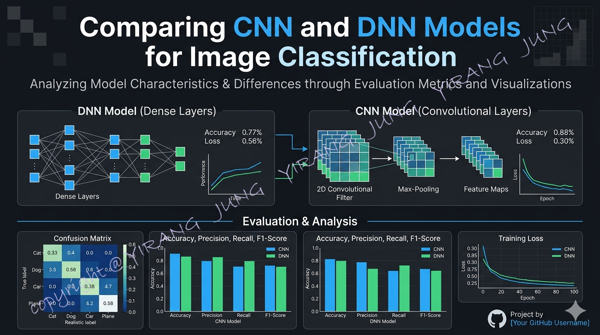

# CIFAR-10 CNN vs DNN Validation Comparison

[](LICENSE)
[]
[]
[]

Author: Yirang Jung  
License: Apache License 2.0

## 1. Overview

This project compares a Deep Neural Network (DNN) and a Convolutional Neural Network (CNN) on the CIFAR-10 image classification task.

The notebook is designed for stable execution in local environments where Jupyter kernel crashes may occur frequently. To reduce instability, the workflow uses conservative memory settings, staged execution, explicit cleanup, and validation-focused evaluation.

---

## 2. Key Features

- CIFAR-10 train / validation / test workflow
- DNN and CNN model comparison under the same dataset split
- Accuracy, Precision, Recall, and F1-score evaluation
- Learning curve visualization
- Confusion matrix visualization with adaptive text color
- Class-wise metric visualization
- Prediction example and error example visualization
- Kernel-crash-aware notebook structure

---

## 3. Tech Stack

Python | PyTorch | torchvision | NumPy | pandas | Matplotlib | scikit-learn | CUDA | NVIDIA GPU | Jupyter Notebook

---

## 4. Dataset

CIFAR-10 (Canadian Institute for Advanced Research)

- 60,000 RGB images
- 10 classes
- 32x32 image size

Classes:
airplane, automobile, bird, cat, deer, dog, frog, horse, ship, truck

---

## 5. Project Structure

project_root/
├─ notebooks/
│  └─ cifar10_cnn_dnn_validation_compare_confusion_adaptive_text.ipynb
├─ assets/
│  └─ confusion_matrix_example.png
├─ README.md
├─ LICENSE
├─ NOTICE
├─ requirements.txt
├─ environment.yml
└─ .gitignore

---

## 6. Evaluation Metrics

- Accuracy
- Precision (macro / weighted interpretation available)
- Recall
- F1-score
- Confusion Matrix

---

## 7. Stability Design for Local Training

The notebook is intentionally structured for environments with frequent kernel instability.

- batch_size kept conservative
- num_workers set to 0
- explicit memory cleanup included
- early stopping included
- evaluation separated by stage
- visualization executed after model evaluation

---

## 8. How to Run

Install packages:

```bash
pip install -r requirements.txt
```

or

```bash
conda env create -f environment.yml
conda activate dl_env
```

Launch Jupyter and open:

```bash
notebooks/cifar10_cnn_dnn_validation_compare_confusion_adaptive_text.ipynb
```

---

## 9. Expected Outputs

- DNN training history
- CNN training history
- confusion matrices
- class-wise metric charts
- prediction sample images
- DNN vs CNN comparison summary

---

## 10. License

Apache License 2.0

All project-specific images and visual materials are protected by copyright.
Unauthorized standalone reuse, redistribution, or commercial reuse of original visual assets is prohibited unless separately permitted by the author.

---

## 11. Author

Yirang Jung
